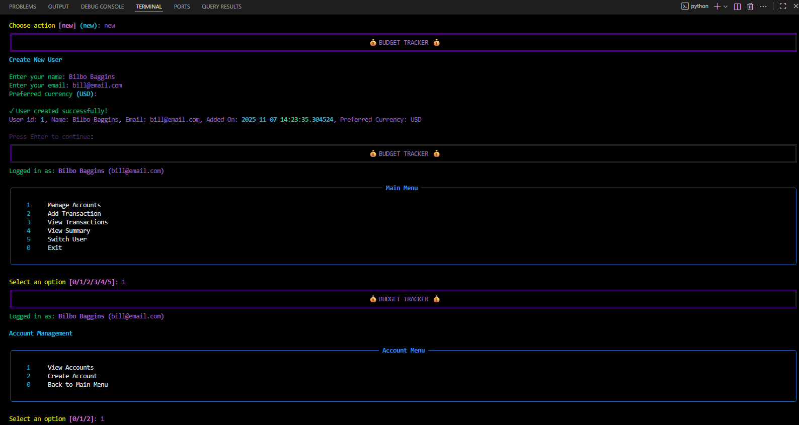

# 💰 Budget Tracking CLI
**The Budget Tracker CLI is a fully functional, beautiful command-line application for personal finance management. built with Python and the `rich` library is and provides a interactive way to manage your personal finances directly from your terminal.**

## ✨ Features
- 💰 **User Management** - Create and switch between multiple users
- 🏦 **Account Management** - Track checking, savings, credit cards, and cash
- 📊 **Transaction Tracking** - Record income and expenses with categories
- 📈 **Financial Summaries** - View balances, totals, and category breakdowns
- 🎨 **Beautiful Interface** - Color-coded tables and interactive prompts

## 🎓 Demonstrates
- CLI application development
- Rich library usage
     **Color-coded text**: Green for income, red for expenses, etc.
    - **Beautiful tables**: Clean, formatted data display
    - **Panels and borders**: Professional-looking UI elements
    - **Interactive prompts**: User-friendly input handling
    - **Progress indicators**: Clear feedback
- Object-oriented programming
- Data modeling
- User interface design
- Documentation writing
- Project organization

# 🎬 How to Run
`....BudgetTracker\CLI python run_cli.py`

### First Time Setup
1. Create a user (option 1)
2. Create an account (option 1 → 2)
3. Add some transactions (option 2)
4. View your summary (option 4)

## 📚 Documentation
- **[Features](./Documentation/FEATURES.md)**
- **[User Guide](./Documentation/CLI_USAGE.md)**
- **[Data Models](./Documentation/MODELS.md)**

